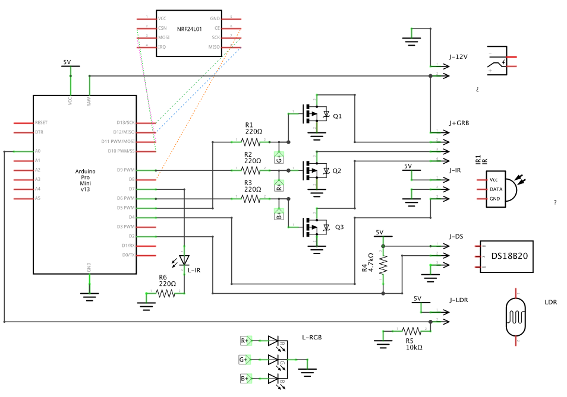
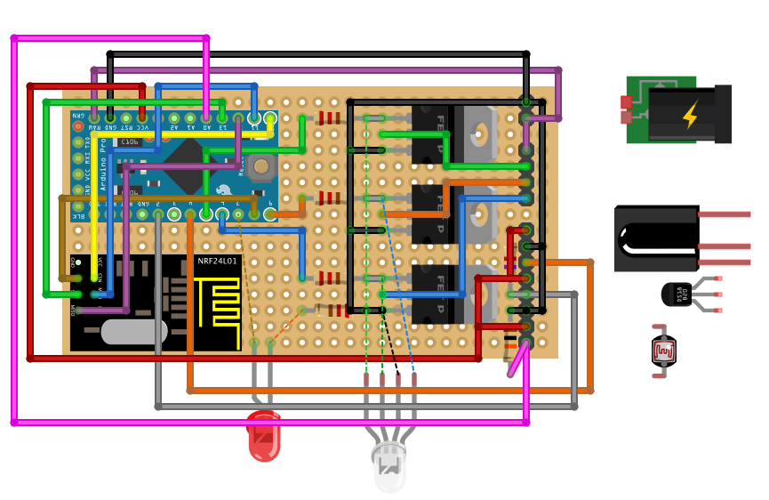

This Arduino Sketch is a [MySensors](https://www.mysensors.org/) project to control an RGB let strip. It can be controlled using Mysensors messages,but also using a basic Infra Red remote. The sketch also reports temperature (using a DS18B20) and luminosity (from an LDR).

## Sketch Information
The sketch provide the following features:
- presents 2 Actuators Childs as both S_RGB_LIGHT , while second child interprets received RVB messages as HSV messages
- presents 2 Sensors Childs as S_TEMP and S_LIGHT_LEVEL
- Receives messages : V_RVB, V_DIMMER_, V_STATUS, V_VAR2 (animation), V_VAR3 (speed)
- Send MySensors messages every 2 minutes : V_TEMP, V_LIGHT_LEVEL
- Directly Receive all IR remote buttons
- Show IR & Messages activity on a Led.

## Required LIbraries
Apart from common libraries included in the MySensors Project, you will need to add :

 - [FastLed](https://github.com/FastLED/FastLED) which implements HSV methods
 - [IRremote](https://github.com/z3t0/Arduino-IRremote) or IRremoteNEC (see below)

In order to fit the sketch In an ArduinoPro Mini memory, I had to minimize the IRremote library, so that it only include NEC codes.
- if you want to use the whole sketch you will have to copy the modified **IRremote_NEC** (Included in the Libraries folder) in your main arduino libraries folder.
- If you dont need the DS18B20 feature, you might rather remove all the code related to Dallas OneWire, and include the genuine IRremote library, which may fit into memory.

## Hardware notes
- In order to drive enough juice to the gate of the MOSFET that I have used (IRL44Z), you must use a 5V arduino. (the 3.3V version wont deliver enought voltage!)
- The schematic doesn't include a 5V to 3.3V converter, because I've used this convenient [adapter board](http://www.aliexpress.com/item/New-Socket-Adapter-plate-Board-for-8Pin-NRF24L01-Wireless-Transceive-module-51/32230227557.html)
- The RGB led is helpful for debugging purpose, but not really needed in "production"
- The IR receiver in the schematic doesn't have the same pinnout as mine.

## Schematic

## Photos

#### Parts used

#### In the box

## Wiring Overview

